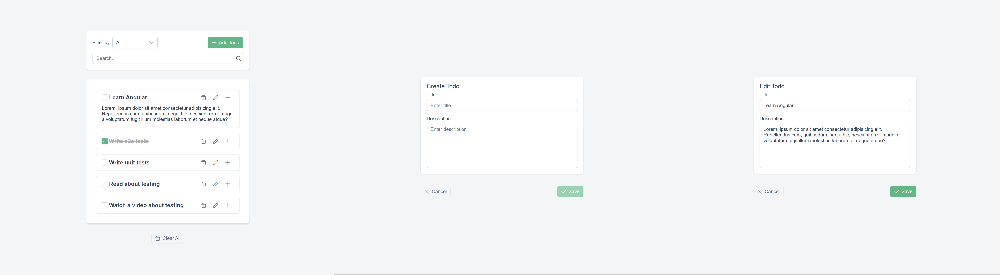

# E2E Testing of an Angular Application with Cypress

Modern web applications are becoming increasingly complex, and manual testing is growing more time-consuming and error-prone. Repetitive actions take up valuable time and increase the risk of mistakes. The solution is automation. E2E (end-to-end) tests allow us to simulate real user behavior and ensure that the application functions as expected from start to finish.

# Table of Contents

1. [How E2E Tests Differ from Unit and Integration Tests](#how-e2e-tests-differ-from-unit-and-integration-tests)

2. [Tools for E2E Testing](#tools-for-e2e-testing)

3. [Environment Setup](#environment-setup)

4. [Cypress Testing Basics](#cypress-testing-basics)

   - [Writing an E2E Test](#writing-an-e2e-test)
   - [Commands](#commands)
     - [Query Commands](#query-commands)
     - [Action Commands](#action-commands)
     - [Assertion Commands](#assertion-commands)
     - [Other Commands](#other-commands)

5. [Example Application](#example-application)

6. [Basic Test](#basic-test)

   - [Verifying Todo List Rendering](#verifying-todo-list-rendering)
   - [Verifying Todo Expansion and Collapse](#verifying-todo-expansion-and-collapse)

7. [API Interaction](#api-interaction)

8. [Creating Custom Commands](#creating-custom-commands)

   - [Parent Commands](#parent-commands)
     - [getByTestId](#getbytestid)
     - [getByPlaceholder](#getbyplaceholder)
   - [Child Command](#child-command)
   - [Usage](#usage)

9. [Working with Forms](#working-with-forms)

   - [Setup](#setup)
   - [Navigating to the Create Page](#navigating-to-the-create-page)
   - [Filling Out the Form](#filling-out-the-form)
   - [Saving a New Todo](#saving-a-new-todo)
   - [Form Validation](#form-validation)
   - [Cancelling Creation](#cancelling-creation)

10. [Preparing Mock Data](#preparing-mock-data)

    - [Intercept](#intercept)
    - [Fixture](#fixture)
    - [Managing Mock Data via API](#managing-mock-data-via-api)

11. [User Scenarios](#user-scenarios)

    - [Scenario One: Changing Todo Status](#scenario-one-changing-todo-status)
    - [Scenario Two: Filtering the Todo List](#scenario-two-filtering-the-todo-list)
    - [Scenario Three: Deleting a Todo Item](#scenario-three-deleting-a-todo-item)

12. [Summary](#summary)

## How E2E Tests Differ from Unit and Integration Tests

- **Unit tests** check individual functions and components in isolation.
- **Integration tests** verify how different modules work together.
- **E2E tests** simulate user behavior and cover the entire flow "from UI to database."

**Key Characteristics of E2E Testing:**

- Broad coverage: includes all layers of the application
- Full environment: requires backend, frontend, and a database
- Slower than other types of tests
- Harder to maintain: must account for asynchronicity, loading states, and unstable scenarios

## Tools for E2E Testing

Angular supports various E2E frameworks such as Cypress, Nightwatch, WebdriverIO, Playwright, and Puppeteer. In this guide, we'll focus on Cypress — one of the most popular tools for end-to-end testing today, widely used by many teams.

**Why Cypress:**

- Easy to set up
- Convenient UI for debugging
- Powerful and intuitive API
- Fast reload on changes (hot reloading)
- Built-in CI/CD integration
- Advanced features: intercept, time-travel, automatic screenshots and video
- Comprehensive documentation and an active community

## Environment Setup

To install and configure Cypress for an Angular application, you simply need to run the command:

```sh
ng e2e
```

After this, the Angular CLI will prompt you to choose from several E2E frameworks — select Cypress. The CLI will then guide you through the environment setup:

```sh
❯ ng e2e
Cannot find "e2e" target for the specified project.
You can add a package that implements these capabilities.
For example:
Cypress: ng add @cypress/schematic
Nightwatch: ng add @nightwatch/schematics
WebdriverIO: ng add @wdio/schematics
Playwright: ng add playwright-ng-schematics
Puppeteer: ng add @puppeteer/ng-schematics
Would you like to add a package with "e2e" capabilities now?
No
❯ Cypress
Nightwatch
WebdriverIO
Playwright
Puppeteer

 Would you like to add a package with "e2e" capabilities now? Cypress
✔ Determining Package Manager
  › Using package manager: npm
✔ Searching for compatible package version
  › Found compatible package version: @cypress/schematic@3.0.0.
✔ Loading package information from registry
✔ Confirming installation
✔ Installing package
✔ Would you like the default `ng e2e` command to use Cypress? [ Protractor to Cypress Migration Guide:
https://on.cypress.io/protractor-to-cypress?cli=true ] Yes
✔ Would you like to add Cypress component testing?  This will add all files needed for Cypress component testing. No

...

✔ Packages installed successfully.
```

This command will do the following:

- Add Cypress to `package.json`
- Create the Cypress configuration file `cypress.config.ts`
- Update `angular.json` to work with Cypress
- Create a `cypress` subdirectory with a basic test scaffold

> ❗ **Practical tip:** Setting up Cypress in an Angular project may unexpectedly affect Angular CLI configuration. This is due to the `@cypress/schematic` package, which integrates with the CLI and modifies the behavior of commands like `ng generate`. This can conflict with your existing project setup.
> For example, if your project uses the `SCSS` preprocessor, after installing the schematic, `ng generate component` might start generating components with `.css` files instead of `.scss`.
> Be cautious when installing `@cypress/schematic`. At the time of writing, there is no official fix — your options are to manually correct the issues or wait for an update to the package.

The `cypress` folder includes:

- A `tsconfig.json` configuration file specifically for this folder’s TypeScript files
- An `e2e` directory for end-to-end tests
- A `support` directory for custom commands and helpers
- A `fixtures` directory for test data

## Cypress Testing Basics

Cypress is built on top of two frameworks: `Mocha` (for test structure) and `Chai` (for assertions and checks). E2E tests in Cypress follow a structure similar to unit tests, using `describe`, `it`, and helper hooks like `beforeEach`, `afterEach`, etc.

### Writing an E2E Test

Test files are located in the `cypress/e2e` folder. Each test file must have the `.cy.ts` extension — otherwise, Cypress will not recognize it as a test.

Example of a simple test:

```ts
describe('Hello World Test', () => {
  beforeEach(() => {
    cy.visit('/');
  });

  it('should show `Hello World` message', () => {
    cy.get('h1').should('have.text', 'Hello World');
  });
});
```

### Commands

Cypress uses special instructions called _commands_ to describe what the test should do. There are four main types of [commands](https://docs.cypress.io/api/table-of-contents#Commands):

- `query` – commands that read the state of the application
- `action` – commands that simulate user interactions
- `assertion` – commands that verify expected conditions
- `other` – miscellaneous commands useful for testing

It’s important to understand that since Cypress interacts with the real user interface, its commands are **asynchronous**. Commands do not execute immediately; instead, Cypress queues them and runs them in order when the test executes.

Commands can be chained together (_command chaining_) for better readability. Cypress automatically manages the execution of the promise chain, passing the result of each command (called the _subject_) to the next one. This continues until the chain completes or an error occurs.

> Learn more about [command chaining](https://learn.cypress.io/cypress-fundamentals/command-chaining)

#### Query Commands

Used to retrieve elements and data from the page.

Examples:

```ts
cy.get('[data-testid="save-button"]');
cy.get('[data-testid="panel"]').find('[data-testid="save-button"]');
cy.contains('Submit');
cy.url().should('include', '/dashboard');
```

#### Action Commands

Simulate user actions like clicking or typing. Cypress automatically waits until the element is ready.

Examples:

```ts
cy.get('input[name="email"]').type('test@example.com');
cy.get('button').click();
```

#### Assertion Commands

Check if an element or state matches expected conditions. Use `should()` or its alias `and()`.

Examples:

```ts
cy.get('h1').should('contain.text', 'Welcome');
cy.get('.error').should('not.exist');
```

#### Other Commands

Cypress offers many additional commands to help with testing.

- `cy.visit()`, `cy.go()` – for navigation
- `cy.request()` – to perform API requests
- `cy.getAllLocalStorage()` – to access local storage
- `cy.reload()` – to reload the page

You can find more details about commands in the [official Cypress documentation](https://docs.cypress.io/api/table-of-contents).

## Example Application

To better understand how Cypress works in practice, we'll use a simple Todo application as our example. It includes common functionality found in many frontend apps:

- Displaying a list of tasks
- Changing a task’s status (completed/incomplete)
- Filtering tasks (by title or status)
- Adding a task
- Editing a task
- Deleting a task (with confirmation via a modal)
- Clearing the entire task list (also with confirmation via a modal)



In this guide, we won't cover every single feature in tests to avoid repetition. Instead, we'll focus on **key scenarios** that illustrate the main approaches to E2E testing with Cypress.

## Basic Test

The first step is to ensure that the task list (`Todo list`) is displayed correctly and that interactions with its elements work as expected.

Since the application does not persist state between tests, you need to explicitly call `cy.visit('/')` before each test case:

```ts
describe('Todo List Test', () => {
  beforeEach(() => {
    cy.visit('/');
  });
});
```

> **TIP:** You don't need to specify the full URL — the `baseUrl` is defined in `cypress.config.ts`. Learn more in the [official documentation](https://docs.cypress.io/app/references/configuration).

### Verifying Todo List Rendering

Let’s check that the task list is present on the page and that it’s not empty:

```ts
it('should find todo list', () => {
  cy.get('[data-testid="todo-list"]').should('exist').and('have.class', 'todo-list');
});

it('should have todo items', () => {
  cy.get('[data-testid="todo-item"]').should('exist').and('have.length.greaterThan', 0);
});
```

### Verifying Todo Expansion and Collapse

Many Todo items contain a description that is hidden by default. We'll test that this description can be toggled using a button:

```ts
it('should expand todo item', () => {
  cy.get('[data-testid="todo-item"]').first().as('todoItem');
  cy.get('@todoItem').find('.p-panel-toggler').click();
  cy.get('@todoItem').find('[data-testid="todo-description"]').should('be.visible');
});

it('should collapse todo item', () => {
  cy.get('[data-testid="todo-item"]').first().as('todoItem');
  cy.get('@todoItem').find('.p-panel-toggler').click();
  cy.get('@todoItem').find('[data-testid="todo-description"]').as('description').should('be.visible');
  cy.get('@todoItem').find('.p-panel-toggler').click();
  cy.get('@description').should('not.be.visible');
});
```

These tests verify that the task list is successfully rendered and responds to user actions — specifically, that you can expand and collapse a task’s description. This forms a solid foundation for more advanced test scenarios later on.

## API Interaction

In the previous test, we relied on the server responding quickly since the app and API run on the same machine. However, in real-world scenarios, the server might be remote, experience delays, or be temporarily unavailable. This can cause Cypress to perform actions before the server responds — leading to test failures.

To synchronize test actions with API responses, we use the commands `cy.intercept()` and `cy.wait()`:

- `cy.intercept()` lets you monitor or modify HTTP requests and responses.
- `cy.wait()` pauses test execution until a response with a specified alias is received.

Example setup in `beforeEach`:

```ts
beforeEach(() => {
  cy.intercept('GET', Cypress.env('API_URL')).as('getTodos');
  cy.visit('/');
  cy.wait('@getTodos');
});
```

> **TIP:** `cy.intercept()` works great with `cy.fixture()` to mock requests and write integration tests where real server interaction isn’t needed. We’ll cover this later in the guide. You can also check out the [official documentation](https://docs.cypress.io/api/commands/fixture#Accessing-Fixture-Data).

This way, we can reliably control client-server interactions, making tests more stable and predictable.

## Creating Custom Commands

To simplify accessing elements by `data-testid` and other attributes, we can create our own Cypress commands. This helps to:

- avoid repeating long selectors;
- improve test readability;
- reduce potential errors.

Cypress supports custom commands registration via `Cypress.Commands.add`.

> **TIP:** Learn more about custom commands in the [Cypress documentation](https://on.cypress.io/custom-commands).

### Parent Commands

These commands do not depend on previous calls and always start a new chain. In our example, we'll create two such commands:

1. `getByTestId` — to find elements by the `data-testid` attribute
2. `getByPlaceholder` — to find elements by the `placeholder` attribute

#### getByTestId

**1. Command logic**

```ts
function getByTestId<E extends Node = Element>(
  testId: string,
  options?: Partial<Cypress.Loggable & Cypress.Timeoutable & Cypress.Withinable & Cypress.Shadow>
): Cypress.Chainable<JQuery<E>> {
  return cy.get(`[data-testid="${testId}"]`, options);
}
```

**2. Registration**

```ts
Cypress.Commands.add('getByTestId', getByTestId);
```

**3. Extending global `cy` object**

```ts
declare namespace Cypress {
  interface Chainable<Subject = any> {
    /**
     * Get one ore more DOM elements by their data-testid attribute.
     *
     * @param testId The data-testid attribute value to search for.
     * @param options cy.get options.
     */
    getByTestId<E extends Node = Element>(
      testId: string,
      options?: Partial<Cypress.Loggable & Cypress.Timeoutable & Cypress.Withinable & Cypress.Shadow>
    ): Cypress.Chainable<JQuery<E>>;
  }
}
```

#### getByPlaceholder

Similarly:

```ts
function getByPlaceholder<E extends Node = Element>(
  placeholder: string,
  options?: Partial<Cypress.Loggable & Cypress.Timeoutable & Cypress.Withinable & Cypress.Shadow>
): Cypress.Chainable<JQuery<E>> {
  return cy.get(`[placeholder="${placeholder}"]`, options);
}

Cypress.Commands.add('getByPlaceholder', getByPlaceholder);

declare namespace Cypress {
  interface Chainable<Subject = any> {
    ...

    /**
     * Get one or more DOM elements by their placeholder attribute.
     *
     * @param placeholder The placeholder attribute value to search for.
     * @param options cy.get options.
     */
    getByPlaceholder<E extends Node = Element>(
      placeholder: string,
      options?: Partial<Cypress.Loggable & Cypress.Timeoutable & Cypress.Withinable & Cypress.Shadow>
    ): Cypress.Chainable<JQuery<E>>;
  }
}
```

### Child Command

A child command always comes in a chain after a parent or another child command and receives the subject from them. In our example, we'll create a `findByTestId` command to find an element within a parent by `data-testid`.

**1. Command logic and registration**

```ts
Cypress.Commands.add('findByTestId', { prevSubject: 'element' }, (subject, testId, options) => {
  return cy.wrap(subject).find(`[data-testid="${testId}"]`, options);
});
```

> **TIP:** It’s easiest to define these commands directly inside `Cypress.Commands.add` to avoid typing issues with the subject.

**2. Extending global `cy` object**

```ts
declare namespace Cypress {
  interface Chainable<Subject = any> {
    ...

    /**
     * Find one or more DOM elements by their data-testid attribute within a subject.
     *
     * @param subject The subject to search within.
     * @param options The options for the find operation.
     */
    findByTestId<E extends Node = Element>(
      testId: string,
      options?: Partial<Cypress.Loggable & Cypress.Timeoutable & Cypress.Shadow>
    ): Cypress.Chainable<JQuery<E>>;
  }
}
```

### Usage

Here's how these commands can be used in tests:

```ts
describe('Todo List Test', () => {
  beforeEach(() => {
    cy.intercept('GET', Cypress.env('API_URL')).as('getTodos');
    cy.visit('/');
    cy.wait('@getTodos');
  });

  it('should find todo list', () => {
    cy.getByTestId('todo-list').should('exist').and('have.class', 'todo-list');
  });

  it('should have todo items', () => {
    cy.getByTestId('todo-item').should('exist').and('have.length.greaterThan', 0);
  });

  it('should expand todo item', () => {
    cy.getByTestId('todo-item').first().as('todoItem');
    cy.get('@todoItem').find('.p-panel-toggler').click();
    cy.get('@todoItem').findByTestId('todo-description').should('be.visible');
  });

  it('should collapse todo item', () => {
    cy.getByTestId('todo-item').first().as('todoItem');
    cy.get('@todoItem').find('.p-panel-toggler').click();
    cy.get('@todoItem').findByTestId('todo-description').as('description').should('be.visible');
    cy.get('@todoItem').find('.p-panel-toggler').click();
    cy.get('@description').should('not.be.visible');
  });
});
```

## Working with Forms

Let's look at working with forms using the example of creating a Todo. The main focus here is interacting with `input` and `textarea` fields. Useful commands for such tests are: `cy.type()`, `cy.clear()`, `cy.focus()`, `cy.blur()`, and checks for form state.

### Setup

Before each test we:

- set up intercepts for save and fetch requests;
- navigate to the form via the "Add Todo" button.

```ts
describe('Create Todo Test', () => {
  const uniqueId = getTestId();

  beforeEach(() => {
    cy.intercept('POST', Cypress.env('API_URL')).as('saveTodo');
    cy.intercept('GET', Cypress.env('API_URL')).as('getTodos');
    cy.visit('/');
    cy.contains('Add Todo').click();
  });
});
```

> **Tip:** `uniqueId` will help us in following test cases as well as identifying Todos created during testing.

### Navigating to the Create Page

Let's verify that the **Add Todo** button actually navigates to the creation form page:

```ts
it('should navigate to the Create page', () => {
  cy.url().should('eq', `${Cypress.config().baseUrl}create`);
  cy.contains('Create Todo').should('be.visible');
});
```

### Filling Out the Form

Check field availability and the behavior of the save button.

```ts
it('should fill in the form', () => {
  cy.getByTestId('save-todo').should('be.visible').and('be.disabled');
  cy.getByPlaceholder('Enter title').should('be.visible').and('be.enabled').type(`Test Todo ${uniqueId}`);
  cy.getByPlaceholder('Enter description').should('be.visible').and('be.enabled').type('Test Description');
  cy.getByTestId('save-todo').should('be.visible').and('be.enabled');
});
```

### Saving a New Todo

Test the main functionality — saving the Todo:

```ts
it('should save todo item', () => {
  cy.getByPlaceholder('Enter title').type(`Test Todo ${uniqueId}`);
  cy.getByPlaceholder('Enter description').type('Test Description');
  cy.getByTestId('save-todo').click();
  cy.wait('@saveTodo');
  cy.url().should('eq', `${Cypress.config().baseUrl}`);
  cy.wait('@getTodos');
  cy.get('.todo-items').scrollTo('bottom');
  cy.contains(`Test Todo ${uniqueId}`).closest('[data-testid="todo-item"]').as('todoItem');
  cy.get('@todoItem').scrollIntoView().should('be.visible');
  cy.get('@todoItem').find('.p-panel-toggler').click();
  cy.get('@todoItem').contains('Test Description').should('be.visible');
});
```

### Form Validation

Check that the form shows errors and disables saving when data is invalid:

```ts
it('should validate form', () => {
  cy.getByPlaceholder('Enter title').as('titleInput').focus().blur();
  cy.contains('Value is required').should('be.visible');
  cy.get('@titleInput').type('a');
  cy.contains('Value must be at least 3 characters').should('be.visible');
  cy.getByTestId('save-todo').should('be.disabled');
  cy.get('@titleInput').type('abcd');
  cy.getByTestId('save-todo').should('be.enabled');
  cy.contains('Value must be at least 3 characters').should('not.exist');
});
```

### Cancelling Creation

Check that cancelling works and the new Todo is not created:

```ts
it('should cancel todo item creation', () => {
  cy.getByPlaceholder('Enter title').type('Test Todo');
  cy.getByPlaceholder('Enter description').type('Test Description');
  cy.getByTestId('cancel-todo').click();
  cy.url().should('eq', `${Cypress.config().baseUrl}`);
  cy.contains(/Test Todo$/).should('not.exist');
});
```

## Preparing Mock Data

One of the key tasks in E2E testing is controlling the data state. A good test should be:

- reproducible;
- stable;
- independent from the external environment state.

To achieve this, it is important to work with **predictable test data**. Cypress offers several approaches:

- replacing real API requests (`cy.intercept()`);
- loading pre-prepared data (fixtures);
- creating and deleting data directly via API (`cy.request()`).

### Intercept

`cy.intercept()` is a powerful Cypress command that allows intercepting HTTP requests, modifying them, canceling, mocking responses, or simply observing them.

#### How to use:

1. Mock a server response

```ts
cy.intercept('GET', '/api/todos', {
  statusCode: 200,
  body: [{ id: 1, title: 'Mocked todo', completed: false }],
});
```

2. Mock using a fixture

```ts
cy.intercept('GET', '/api/todos', { fixture: 'todos.json' });
```

#### When to use

- For testing edge cases
- If independence from backend is needed
- To speed up tests
- For full UI isolation

### Fixture

Fixtures are pre-prepared and saved sets of test data used to simulate server responses or to be injected into tests. In Cypress, fixtures are stored in the `cypress/fixtures` directory. You can read more about fixtures in the [Cypress documentation](https://docs.cypress.io/api/commands/fixture#Default-Encoding).

#### How to use:

1. Load manually

```ts
cy.fixture('file.json').then((data) => {
  // some code
});
```

2. Use together with `cy.intercept()`

```ts
cy.intercept('GET', '/api/todos', { fixture: 'file.json' });
```

#### When to use

- To ensure data repeatability
- Along with `cy.intercept` to simulate server responses
- Testing edge cases
- In tests independent of the server and integration tests

### Managing Mock Data via API

When it is important to test real behavior, we can create/delete data directly via API. This provides:

- realism;
- precise control over initial state;
- ability to work with database data directly.

#### How to use:

1. Creating mock data

```ts
cy.request({
  method: 'POST',
  url: Cypress.env('API_URL'),
  body: {
    id: id.toString(),
    title: `Test Todo ${id}`,
    description: 'Test Description',
    isComplete: false,
  },
});
```

2. Deleting mock data

```ts
cy.request({
  method: 'DELETE',
  url: `${Cypress.env('API_URL')}/${id}`,
});
```

#### When to use

- For end-to-end tests “from start to finish”;
- If working with a real database is important;
- When you need to manage data within a single test (create → verify → delete);
- For fast and flexible environment setup.

## User Scenarios

Now that we have covered the tools and basics of working with Cypress, let's apply them in practice and write full E2E tests for typical user scenarios:

- changing the status of a todo,
- filtering the list,
- deleting with confirmation.

### Scenario One: Changing Todo Status

We will verify that a user can change the status of a todo item.

#### Setup

We use `createTestTodo()` and `removeTestTodo()` — helper functions that interact directly with the API. This allows us to create isolated test data and clean it up after the scenario runs. The code for these functions is as follows:

```ts
export const createTestTodo = (id: string | number) => {
  return cy.request({
    method: 'POST',
    url: Cypress.env('API_URL'),
    body: {
      id: id.toString(),
      title: `Test Todo ${id}`,
      description: 'Test Description',
      isComplete: false,
    },
  });
};

export const removeTestTodo = (id: string | number) => {
  return cy.request({
    method: 'DELETE',
    url: `${Cypress.env('API_URL')}/${id}`,
  });
};
```

#### Test Cases

```ts
describe('Todo Status Change Test', () => {
  const uniqueId = getTestId();

  before(() => {
    createTestTodo(uniqueId);
  });

  beforeEach(() => {
    cy.visit('/');
    cy.intercept('GET', Cypress.env('API_URL')).as('getTodos');
    cy.intercept('POST', Cypress.env('API_URL')).as('saveTodo');
    cy.wait('@getTodos');
  });

  after(() => {
    removeTestTodo(uniqueId);
  });

  it('should complete todo', () => {
    cy.get(`#todo-item-${uniqueId}`).scrollIntoView().as('todoItem');
    cy.get('@todoItem').find('.p-panel-toggler').click();
    cy.get('@todoItem').findByTestId('toggle-todo').click();
    cy.wait('@saveTodo');
    cy.wait('@getTodos');
    cy.get('@todoItem').findByTestId('todo-title').should('have.class', 'completed');
    cy.get('@todoItem').findByTestId('todo-description').should('have.class', 'completed');
  });

  it('should restore todo', () => {
    cy.get(`#todo-item-${uniqueId}`).as('todoItem');
    cy.get('@todoItem').findByTestId('toggle-todo').click();
    cy.wait('@saveTodo');
    cy.wait('@getTodos');
    cy.get('@todoItem').findByTestId('todo-title').should('not.have.class', 'completed');
    cy.get('@todoItem').findByTestId('todo-description').should('not.have.class', 'completed');
  });
});
```

### Scenario Two: Filtering the Todo List

In this test, we interact with `select` and `input` elements and verify the result by checking the number of displayed todos.

#### Setup

Instead of real API requests, we use a fixture with mock data. This speeds up tests and eliminates instability. We also modify the state of the first two todos for better alignment with the testing goals.

#### Test Cases

```ts
describe('Filter Todos Test', () => {
  beforeEach(() => {
    cy.fixture('stub-todo-list.json').then((todos) => {
      cy.intercept('GET', Cypress.env('API_URL'), (req) => {
        todos[0].isComplete = true;
        todos[1].isComplete = true;
        req.reply(todos);
      }).as('getTodos');
    });
    cy.visit('/');
    cy.wait('@getTodos');
  });

  it('should filter todos by title', () => {
    cy.getByTestId('todo-item').should('have.length.greaterThan', 0);
    cy.getByPlaceholder('Search...').as('search').type('Learn Angular');
    cy.getByTestId('todo-item').should('have.length', 1);
    cy.contains('Learn Angular').should('be.visible');
    cy.get('@search').clear().type('Write');
    cy.getByTestId('todo-item').should('have.length', 2);
    cy.contains('Learn Angular').should('not.exist');
  });

  it('should filter `Active` todos', () => {
    cy.getByTestId('todo-filter').click();
    cy.get('p-selectitem').contains('Active').as('activeFilter').should('be.visible');
    cy.getByTestId('todo-item').then(({ length: initialCount }) => {
      cy.get('@activeFilter').click();
      cy.getByTestId('todo-item').should('have.length', initialCount - 2); // As two todos are completed
    });
  });

  it('should filter `Completed` todos', () => {
    cy.getByTestId('todo-filter').click();
    cy.get('p-selectitem').contains('Completed').as('activeFilter').should('be.visible');
    cy.get('@activeFilter').click();
    cy.getByTestId('todo-item').should('have.length', 2); // As two todos are completed
  });

  it('should filter `All` todos', () => {
    cy.getByTestId('todo-item').then(({ length: initialCount }) => {
      cy.getByTestId('todo-filter').click();
      cy.get('p-selectitem').contains('Active').click();
      cy.getByTestId('todo-filter').click();
      cy.get('p-selectitem').contains('All').click();
      cy.getByTestId('todo-item').should('have.length', initialCount);
    });
  });

  it('should filter by status and title', () => {
    cy.getByTestId('todo-filter').click();
    cy.get('p-selectitem').contains('Completed');
    cy.getByPlaceholder('Search...').type('Learn Angular');
    cy.getByTestId('todo-item').should('have.length', 1);
  });
});
```

### Scenario Three: Deleting a Todo Item

We will test two cases:

- successful deletion
- cancelling the action

Since deleting a todo requires confirmation via a modal dialog, we make sure the modal appears and disappears as expected.

#### Setup

This test will also use the `createTestTodo()` function to create test data that will later be deleted.

#### Test Cases

```ts
import { createTestTodo, getTestId } from '../../support/common';

describe('Delete Todo Test', () => {
  const uniqueId = getTestId();

  before(() => {
    createTestTodo(uniqueId);
  });

  beforeEach(() => {
    cy.intercept(Cypress.env('API_URL')).as('getTodos');
    cy.intercept('DELETE', `${Cypress.env('API_URL')}/${uniqueId}`).as('deleteTodo');
    cy.visit('/');
    cy.wait('@getTodos');
  });

  it('should delete todo item', () => {
    cy.getByTestId('todo-item').then(($todoItems) => {
      const initialCount = $todoItems.length;
      cy.get(`#todo-item-${uniqueId}`).findByTestId('remove-todo').click();
      cy.get('.p-dialog').should('be.visible');
      cy.get('.confirm-delete').click();
      cy.wait('@deleteTodo');
      cy.wait('@getTodos');
      cy.getByTestId('todo-item').should('have.length', initialCount - 1);
    });
  });

  it('should cancel todo item deletion', () => {
    cy.getByTestId('todo-item').then(($todoItems) => {
      const initialCount = $todoItems.length;
      cy.getByTestId('remove-todo').first().click();
      cy.get('.p-dialog').should('be.visible');
      cy.get('.decline-delete').click();
      cy.getByTestId('todo-item').should('have.length', initialCount);
    });
  });
});
```

## Summary

In this guide, we have step-by-step covered the basics of end-to-end testing for Angular applications using Cypress. We have:

- set up Cypress and integrated it into an Angular project;
- learned the basic test structure, commands, and user hooks;
- mastered working with forms and asynchronous requests;
- reviewed approaches to handling mock data—from intercepts to direct API requests.

Cypress allows writing readable, stable, and reproducible E2E tests that not only protect the application from regressions but also increase confidence in its correct functioning.

### 🔧 What’s next

- Set up [test runs in CI/CD](https://docs.cypress.io/app/continuous-integration/overview), for example via GitHub Actions or GitLab CI.
- Explore [component testing in Cypress](https://docs.cypress.io/app/component-testing/get-started) to test Angular components in isolation.
- Use the [Cypress App](https://www.cypress.io/app) to run and debug tests directly in the browser.

Testing is an essential part of the application lifecycle. Cypress provides a powerful tool to make it easier and more reliable.
